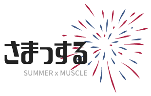

# 2022-summer-c-team

# さまっする（SUMMER x MUSCLE）

https://delightful-cliff-0bb102800.1.azurestaticapps.net/

__さまっする__ は，夏休みに最高にエキサイティングなエクササイズをするために作成したアプリです．

## 機能

### 腹筋検知

腹筋の回数に応じて，あなたを応援する花火が打ち上がります．

### 対戦

仲間と共に，トレーニングで白熱した時間を味わえます．

### カレンダー

夏休みの大切なイベントを目標に，あなたのマッスルを最大化しましょう．

## 使用した技術
言語：JavaScript, html, css

FW：p5.js, ml5.js, SkyWay

インフラ：Azure ( Static Web Apps )

## Contributers
- 伊勢田氷琴(Iseda Hikoto) 奈良先端科学技術大学院大学先端科学技術研究科情報科学領域ユビキタス・コンピューティングシステム研究室M1
- 江畑敬太(Ebata Keita) 東京理科大学先進工学部電子システム工学科B4
- 鈴木絵理(Suzuki Eri) 早稲田大学大学院基幹理工学研究科情報理工・情報通信専攻M1
- 野上泰輔(Nogami Taisuke) 同志社大学大学院理工学研究科電気電子工学専攻M1
- 渡邊優貴(Watanabe Yuki）電気通信大学情報理工学研究科機械知能システム学専攻M1

(五十音順)
